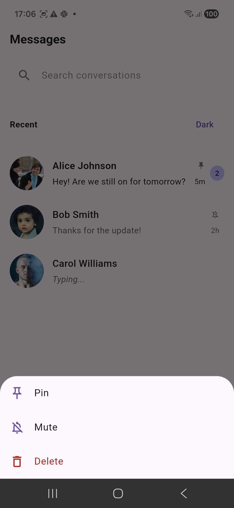
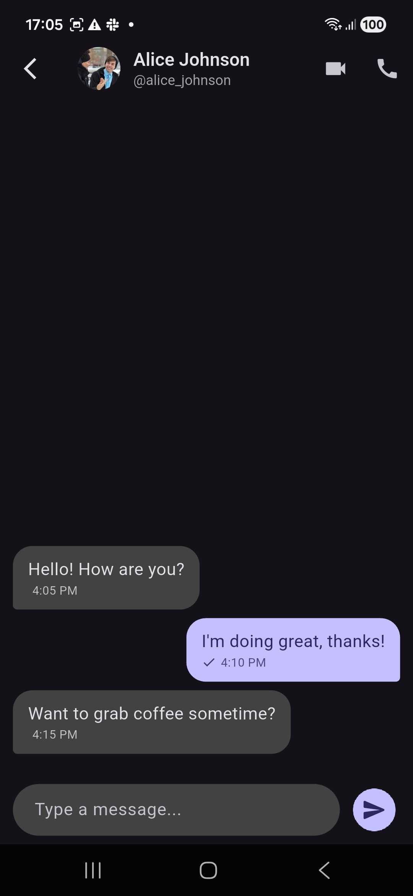
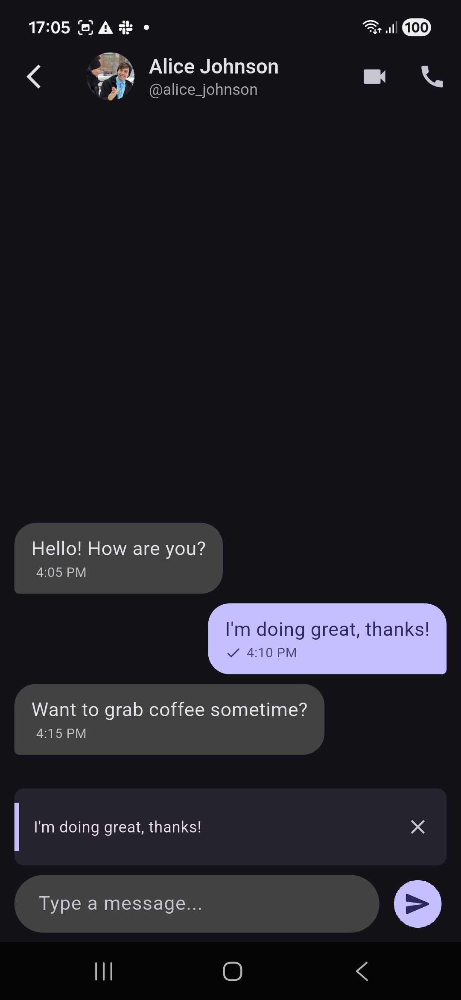

# Flutter Advanced Chat UI

A highly customizable chat interface for Flutter with builder-based customization and composable widgets. Build conversation lists and message threads with search, reactions, replies, typing indicators, and more.

## Screenshots

| Conversation List | Message Thread | Reply Context |
|------------------|----------------|---------------|
|  |  |  |

---

## Table of Contents

- [Screenshots](#screenshots)
- [Features](#features)
- [Installation](#installation)
- [Quick Start](#quick-start)
- [Architecture](#architecture)
- [Package Structure](#package-structure)
- [ConversationList](#conversationlist)
- [MessageThread](#messagethread)
- [Models & Data](#models--data)
- [Theme Customization](#theme-customization)
- [Backend Integration](#backend-integration)
- [Example](#example)
- [License](#license)

---

## Features

### ConversationList
| Feature | Description |
|---------|-------------|
| **Search** | Filter conversations by name or custom logic via `searchFilter` |
| **Unread badges** | Display unread count via `trailingBuilder` |
| **Typing indicators** | Show "Typing..." in tile subtitle when `isTyping` is true |
| **Pin & Mute** | Long-press menu with Pin, Mute, Delete options |
| **Header & Footer** | Optional widgets above/below the scrollable list |
| **Custom tiles** | Full control with `tileBuilder` for custom row layout |

### MessageThread
| Feature | Description |
|---------|-------------|
| **Message bubbles** | Text, image, audio, and custom content types |
| **Delivery status** | Pending, sent, delivered, read, failed with status icons |
| **Reply to messages** | Long-press → Reply, shows reply preview in input bar |
| **Reactions** | Add/remove emoji reactions (👍, ❤️, etc.) on messages |
| **Typing indicator** | Animated three-dot indicator when other user is typing |
| **Reply suggestions** | Quick-reply chips via `replySuggestionsBuilder` |
| **Custom messages** | `customMessageBuilder` for custom message types |

---

## Installation

Add to your `pubspec.yaml`:

```yaml
dependencies:
  flutter_advanced_chat_ui: ^1.0.0
```

Then run:

```bash
flutter pub get
```

---

## Quick Start

### 1. Conversation List Screen

```dart
import 'package:flutter_advanced_chat_ui/flutter_advanced_chat_ui.dart';

class ChatListScreen extends StatefulWidget {
  @override
  State<ChatListScreen> createState() => _ChatListScreenState();
}

class _ChatListScreenState extends State<ChatListScreen> {
  late final ConversationListController _controller;

  @override
  void initState() {
    super.initState();
    _controller = ConversationListController(
      initial: [
        Conversation(
          id: '1',
          title: 'Alice',
          participants: [Participant(id: 'a', displayName: 'Alice')],
          lastMessage: ChatMessage(
            id: 'm1',
            body: 'Hey there!',
            senderId: 'a',
            timestamp: DateTime.now(),
          ),
          unreadCount: 2,
        ),
      ],
    );
  }

  @override
  Widget build(BuildContext context) {
    return ConversationList(
      controller: _controller,
      appBarTitle: 'Messages',
      searchHint: 'Search conversations',
      onConversationTap: (c) => _openChat(c),
      trailingBuilder: (conv) => conv.unreadCount > 0
        ? Container(
            padding: EdgeInsets.symmetric(horizontal: 8, vertical: 4),
            decoration: BoxDecoration(
              color: Theme.of(context).colorScheme.primary,
              borderRadius: BorderRadius.circular(12),
            ),
            child: Text('${conv.unreadCount}', style: TextStyle(color: Colors.white)),
          )
        : null,
    );
  }

  void _openChat(Conversation conv) { /* Navigate to MessageThread */ }
}
```

### 2. Message Thread Screen

```dart
final threadController = MessageThreadController(
  currentUser: Participant(id: 'me', displayName: 'Me'),
  others: conv.participants,
  initial: [
    ChatMessage(
      id: '1',
      body: 'Hello!',
      senderId: 'a',
      timestamp: DateTime.now().subtract(Duration(minutes: 5)),
    ),
  ],
);

MessageThread(
  controller: threadController,
  title: conv.title,
  subtitle: '@${conv.title.toLowerCase().replaceAll(' ', '_')}',
  avatarUrl: conv.avatarUrl,
  appBarActions: [
    IconButton(icon: Icon(Icons.videocam), onPressed: () {}),
    IconButton(icon: Icon(Icons.call), onPressed: () {}),
  ],
)
```

---

## Architecture

The package uses a **controller-based** architecture:

- **ConversationListController** — Holds conversation list state, handles search, pin, mute, add/remove
- **MessageThreadController** — Holds messages, typing state, reply suggestions, reactions

Both extend `ChangeNotifier` and notify listeners when state changes. Widgets listen via `addListener` and rebuild on updates.

**Data flow:**
```
Controller (state) → Widget (UI) → User action → Controller method → notifyListeners → Widget rebuild
```

---

## Package Structure

```
lib/
├── flutter_advanced_chat_ui.dart          # Main export
└── src/
    ├── controllers/
    │   ├── conversation_list_controller.dart
    │   └── message_thread_controller.dart
    ├── models/
    │   ├── conversation.dart
    │   ├── conversation_settings.dart
    │   ├── content_type.dart
    │   ├── delivery_state.dart
    │   ├── message.dart
    │   ├── participant.dart
    │   ├── reaction.dart
    │   └── reply_context.dart
    ├── theme/
    │   └── chat_theme.dart
    └── widgets/
        ├── conversation_list.dart
        ├── conversation_tile.dart
        ├── message_bubble.dart
        ├── message_input.dart
        └── message_thread.dart
```

---

## ConversationList

### Parameters

| Parameter | Type | Default | Description |
|-----------|------|---------|-------------|
| `controller` | `ConversationListController` | required | State controller |
| `theme` | `ChatTheme?` | `ChatTheme.fromContext(context)` | Visual theme |
| `appBarTitle` | `String` | `'Messages'` | App bar title |
| `searchHint` | `String` | `'Search conversations'` | Search field placeholder |
| `header` | `Widget?` | `null` | Widget above the list |
| `footer` | `Widget?` | `null` | Widget below the list |
| `onConversationTap` | `void Function(Conversation)?` | `null` | Called when a tile is tapped |
| `onDelete` | `void Function(Conversation)?` | `null` | Called when delete is chosen |
| `onPinChanged` | `void Function(Conversation, bool)?` | `null` | Called when pin status changes |
| `onMuteChanged` | `void Function(Conversation, bool)?` | `null` | Called when mute status changes |
| `tileBuilder` | `Widget Function(BuildContext, Conversation)?` | `null` | Custom tile widget |
| `trailingBuilder` | `Widget Function(Conversation)?` | `null` | Trailing widget (e.g. badge) |

### ConversationListController Methods

| Method | Description |
|--------|-------------|
| `applySearch(String query)` | Filter list by search term |
| `clearSearch()` | Reset search filter |
| `addConversation(Conversation c)` | Add conversation at top |
| `removeConversation(String id)` | Remove by id |
| `updateConversation(String id, updater)` | Update with function |
| `setPin(String id, bool pinned)` | Pin or unpin |
| `setMute(String id, bool muted)` | Mute or unmute |
| `updateLastMessage(String id, ChatMessage? msg)` | Update last message |
| `setTyping(String id, bool typing)` | Set typing indicator |
| `setUnread(String id, int count)` | Set unread count |

### Custom Search Filter

```dart
ConversationListController(
  initial: conversations,
  searchFilter: (query, items) {
    return items.where((c) =>
      c.title.toLowerCase().contains(query.toLowerCase()) ||
      c.participants.any((p) =>
        p.displayName.toLowerCase().contains(query.toLowerCase()))).toList();
  },
)
```

---

## MessageThread

### Parameters

| Parameter | Type | Default | Description |
|-----------|------|---------|-------------|
| `controller` | `MessageThreadController` | required | State controller |
| `title` | `String` | required | Chat title (e.g. contact name) |
| `subtitle` | `String?` | `null` | Subtitle (e.g. @username) |
| `avatarUrl` | `String?` | `null` | Avatar image URL |
| `theme` | `ChatTheme?` | `ChatTheme.fromContext(context)` | Visual theme |
| `appBarActions` | `List<Widget>?` | `null` | Actions (call, video, etc.) |
| `onBack` | `VoidCallback?` | `Navigator.pop` | Back button action |
| `customMessageBuilder` | `Widget Function(ChatMessage)?` | `null` | Custom message widget |
| `replySuggestionsBuilder` | `Widget Function(List<String>)?` | `null` | Quick-reply chips |

### MessageThreadController Methods

| Method | Description |
|--------|-------------|
| `append(ChatMessage msg)` | Add message to thread |
| `updateStatus(String id, DeliveryState status)` | Update delivery state |
| `addReaction(String messageId, String emoji, String userId)` | Toggle reaction |
| `setReplySuggestions(List<String> items)` | Show reply chips |
| `isTyping` (getter/setter) | Typing indicator visibility |

### Message Types

| ContentType | `body` usage | Display |
|-------------|-------------|---------|
| `text` | Message text | `Text` widget |
| `image` | Image URL | `Image.network` |
| `audio` | — | "Voice message" placeholder |
| `custom` | — | Use `customMessageBuilder` |

### Example: Image Message

```dart
final msg = ChatMessage(
  id: '1',
  body: 'https://example.com/photo.jpg',
  senderId: 'me',
  timestamp: DateTime.now(),
  contentType: ContentType.image,
);
```

### Example: Reply with Context

```dart
// User long-presses a message → Reply → ReplyContext is set
// When sending:
controller.append(ChatMessage(
  id: '2',
  body: 'My reply',
  senderId: 'me',
  timestamp: DateTime.now(),
  replyTo: ReplyContext(
    messageId: '1',
    preview: 'Original message text',
    senderId: 'alice',
    senderName: 'Alice',
  ),
));
```

---

## Models & Data

### Conversation

```dart
Conversation(
  id: String,                    // Unique id
  title: String,                 // Display name
  participants: List<Participant>,
  avatarUrl: String?,             // Optional
  lastMessage: ChatMessage?,     // Optional
  unreadCount: int,              // Default 0
  isTyping: bool,                // Default false
  settings: ConversationSettings, // Default: isPinned=false, isMuted=false
)
```

### Participant

```dart
Participant(
  id: String,
  displayName: String,
  avatarUrl: String?,
  isOnline: bool,  // Default false
)
```

### ChatMessage

```dart
ChatMessage(
  id: String,
  body: String,
  senderId: String,
  timestamp: DateTime,
  contentType: ContentType,      // Default: text
  deliveryState: DeliveryState,  // Default: sent
  replyTo: ReplyContext?,        // Optional
  reactions: List<MessageReaction>, // Default: []
)
```

### DeliveryState

| Value | Description |
|-------|-------------|
| `pending` | Sending |
| `sent` | Sent to server |
| `delivered` | Delivered to recipient |
| `read` | Read by recipient |
| `failed` | Failed to send |

### ReplyContext

```dart
ReplyContext(
  messageId: String,
  preview: String,
  senderId: String?,
  senderName: String?,
)
```

### MessageReaction

```dart
MessageReaction(
  emoji: String,   // e.g. '👍'
  userIds: List<String>,
)
```

---

## Theme Customization

### ChatTheme Properties

| Property | Description |
|----------|-------------|
| `background` | Scaffold background |
| `surface` | Card/surface color |
| `primary` | Primary accent |
| `onBackground` | Text on background |
| `onSurface` | Text on surface |
| `onPrimary` | Text on primary |
| `bubbleOutgoing` | Outgoing message bubble |
| `bubbleIncoming` | Incoming message bubble |
| `bubbleTextOutgoing` | Outgoing text color |
| `bubbleTextIncoming` | Incoming text color |
| `divider` | Divider color |
| `error` | Error color |

### Usage

```dart
// From context (uses Theme.of(context))
theme: ChatTheme.fromContext(context)

// Presets
theme: ChatTheme.light
theme: ChatTheme.dark

// Custom
theme: ChatTheme(
  primary: Color(0xFF6C63FF),
  bubbleOutgoing: Color(0xFF6C63FF),
  bubbleIncoming: Colors.grey.shade200,
)
```

---

## Backend Integration

The package is UI-only. Wire it to your backend:

1. **Conversation list** — Fetch conversations from API, pass to `ConversationListController(initial: [...])`. Use `addConversation`, `removeConversation`, `updateLastMessage` when data changes.

2. **Messages** — Fetch messages, pass to `MessageThreadController(initial: [...])`. Use `append` when new messages arrive. Use `updateStatus` when delivery status changes.

3. **Real-time** — Listen to WebSocket/Stream, call controller methods when events arrive.

```dart
// Example: WebSocket message handler
socket.onMessage((data) {
  threadController.append(ChatMessage(
    id: data.id,
    body: data.text,
    senderId: data.senderId,
    timestamp: DateTime.parse(data.timestamp),
  ));
});
```

---

## Example

Run the example app:

```bash
cd example
flutter run
```

The example includes:
- Conversation list with search
- Dark/light theme toggle
- Message thread with reply and reactions
- Reply suggestions as chips
- Unread badges on conversation tiles

---

## License

MIT License - see [LICENSE](LICENSE) for details.